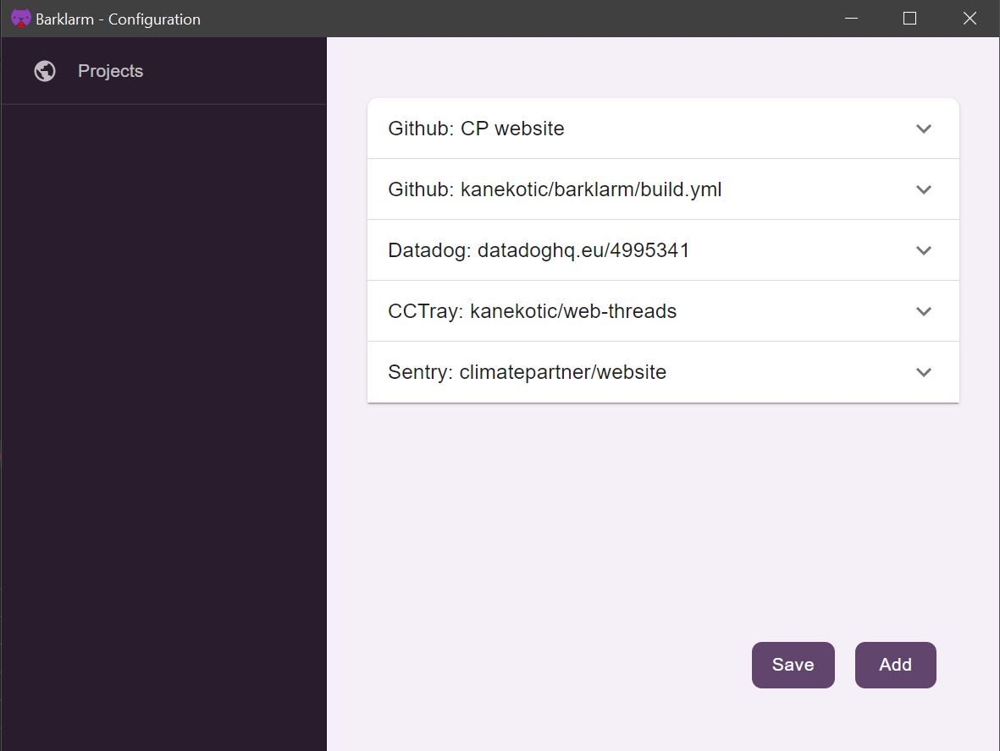

# Configuration Window

This is the place to setup application configurations that can be founnd in the [configuration section](/docs/configuration).

 

The sections it contains are: 
- Projects: you can add/remove/modify observing capacities of your diferent runing projects.

It can be access from the Tray menu through the configuration button

 
