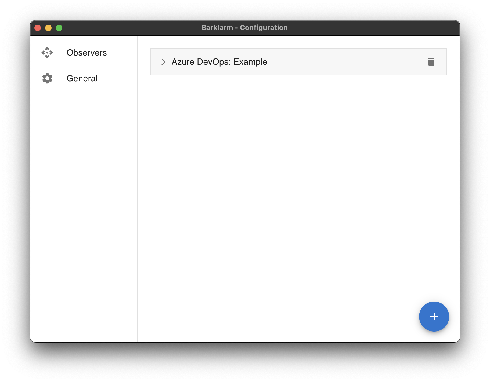
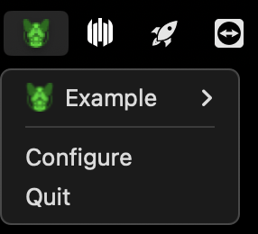

# Configuration Window

This is the place to set up application configurations that can be found in the [configuration section](/docs/configuration).

The sections it contains are:

* Projects: you can add/remove/modify observing capacities of your different running projects.

It can be accessed from the Tray menu through the configuration button

