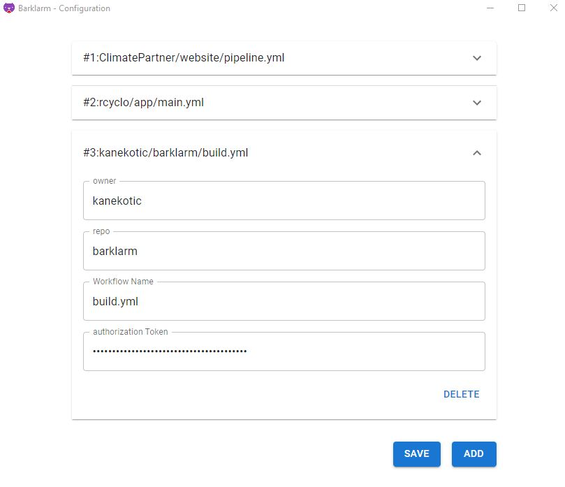

# Configuration Window

The configuration window can be open from the tray menu by cliking on the configure section of the menu.

As seen on the previous image its composed of the next sections:

- List of project configurations: This are the individual projects that can be configured in the application.
- Add Button: allows to add a new configuration section
- Save button: allows to persist the current configuration. This is important as nothing will be configured ontil this button is press.

