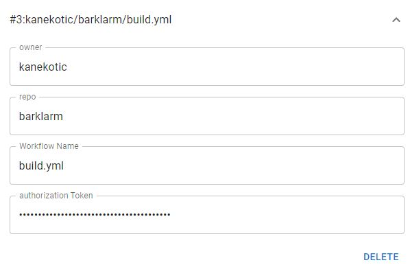

# Github

the github configuration requires:
- Owner: github handle of the user or organization the project belongs to.
- Repo: name of the repository that the pipeline belongs to.
- Workflow Name: name of the pipeline file that is used to track the build.
- Authorization token: this is personal access token used to access the project.

There is also a delete button to remove this configuration from the list.