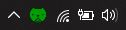
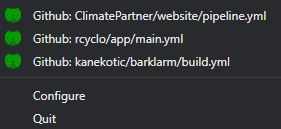

# Tray Menu

## Summary Icon

The summary icon in the tray bar represents the global state of all the configured builds. The meaning of the icon can be found in the [legend section](#legend) of this page.

## Menu

The Summary icon can be right-clicked, this will display the next menu:

This menu is constituted of the next sections:

* Individual projects list: Represents the status of the individual projects.
* Configure button: This will open the configuration window.
* Quit button: This will close the application.

## Legend

The summary icon in the tray bar and the icons for the individual projects in the menu convey information about the project status:

*  The most recent status was successful
*  The most recent status failed
*  The project is refreshing the status.
*  The server or project status are unavailable