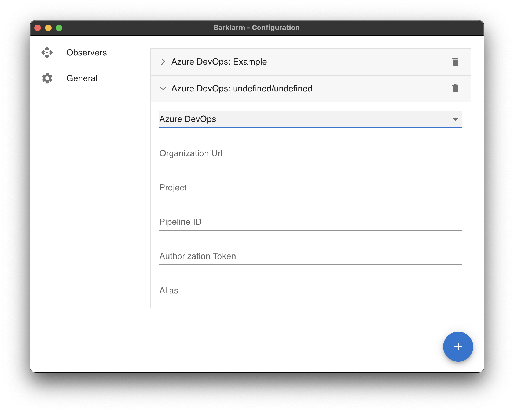

# Azure DevOps

The Azure DevOps configuration requires:
- **Organization Url (Mandatory)**: url to the organization in azure devops or your TFS server.
- **Project (Mandatory)**: name of the project in azure devops.
- **Pipeline ID (Mandatory)**: number that represents the pipeline to track.
- **Authorization token (Mandatory)**: this is user access token to access the project.
- **Alias (Optional)**: A friendly name to display in the tray list.

There is also a **delete button** to remove this configuration from the list.