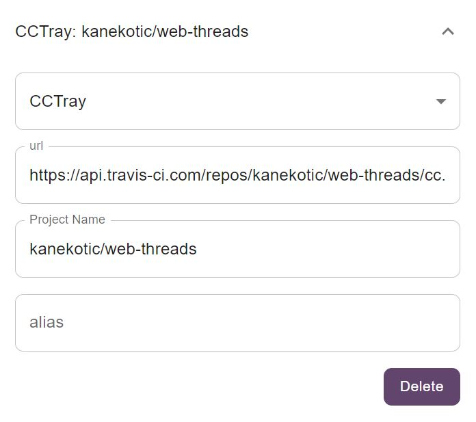

# CCTray

Barklarm support any server that follows [CCtray V1 Specification](https://cctray.org/v1/)

 

the cctray configuration contains:
- **URL (mandatory)**: url to the ccTray xml file. Currently it requires to be a file from a single project, collections are not yet supported.
- **Project Name (optional)**: if multiple projects exist in the xml file this alows to select the one that wants to be targeted. If not defined the first one in the file will be displayed.
- **Alias (optional)**: a frinedly name to recognize this inside barklarm.

There is also a **delete button** to remove this configuration from the list.