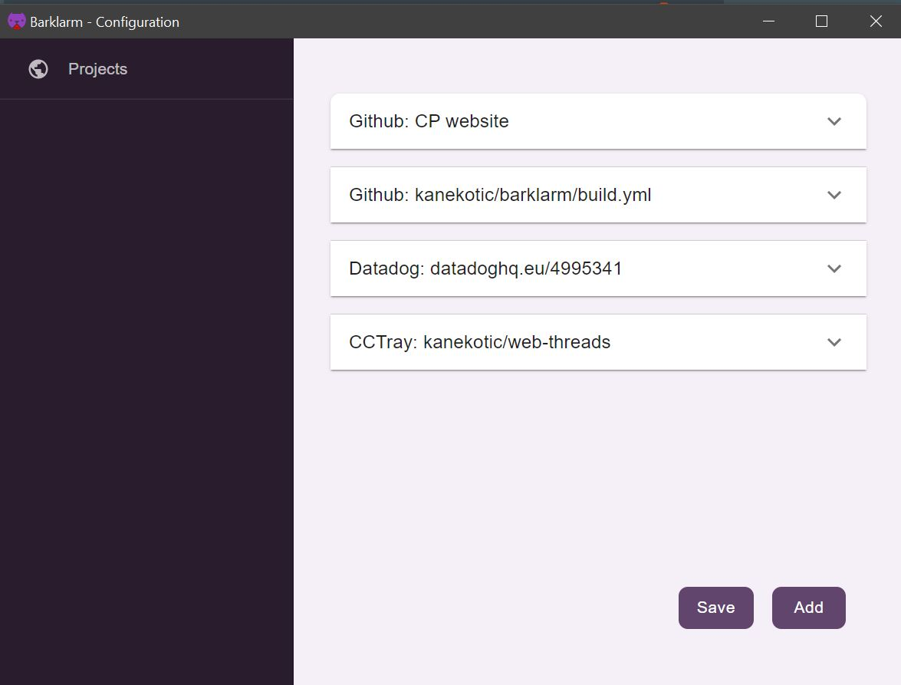

# Configuration

The configuration window can be open from the tray menu by clicking on the configure section of the menu.

As seen on the previous image, it's composed of the next sections:

* List of project configurations: These are the individual projects that can be configured in the application.
* Add Button: allows adding a new configuration section
* Save button: allows persisting the current configuration. This is important as nothing will be configured until this button is press.