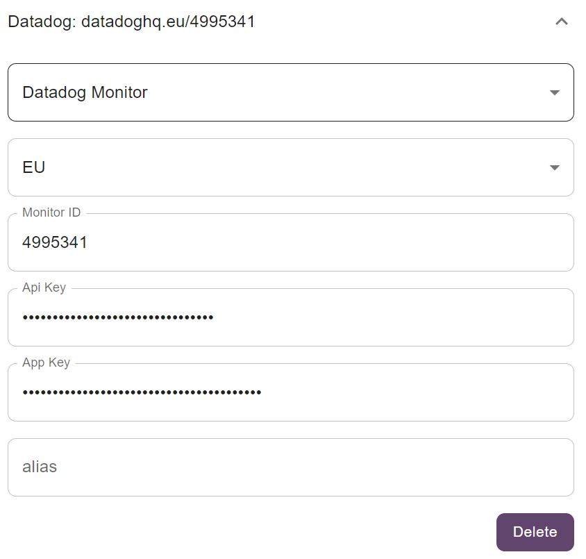

# Datadog Monitors

the datadog configuration requires:
- **Site (Mandatory)**: the datadog site your project resides on.
- **Monitor ID (Mandatory)**: number that identifies your monitor, can be found in the properties of your Monitor.
- **API Key (Mandatory)**: [API Key](https://docs.datadoghq.com/account_management/api-app-keys/#api-keys) to access the datadog system.
- **APP Key (Mandatory)**: [APP Key](https://docs.datadoghq.com/account_management/api-app-keys/#application-keys) to access the datadog system.
- **Alias (Optional)**: A friendly name to display in the tray list.

There is also a **delete button** to remove this configuration from the list.