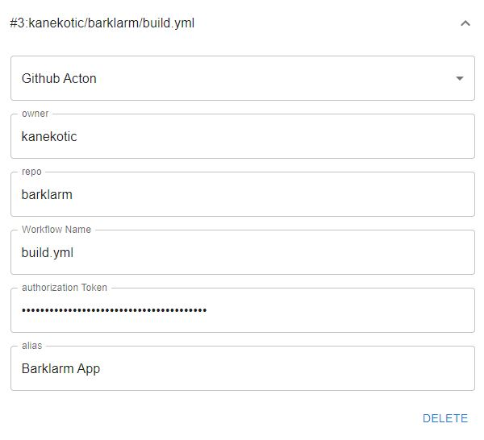

# Github Actions

the github configuration requires:
- **Owner (Mandatory)**: github handle of the user or organization the project belongs to.
- **Repo (Mandatory)**: name of the repository that the pipeline belongs to.
- **Workflow Name (Mandatory)**: name of the pipeline file that is used to track the build.
- **Authorization token (Mandatory)**: this is personal access token used to access the project.
- **Alias (Optional)**: A friendly name to display in the tray list.

There is also a **delete button** to remove this configuration from the list.