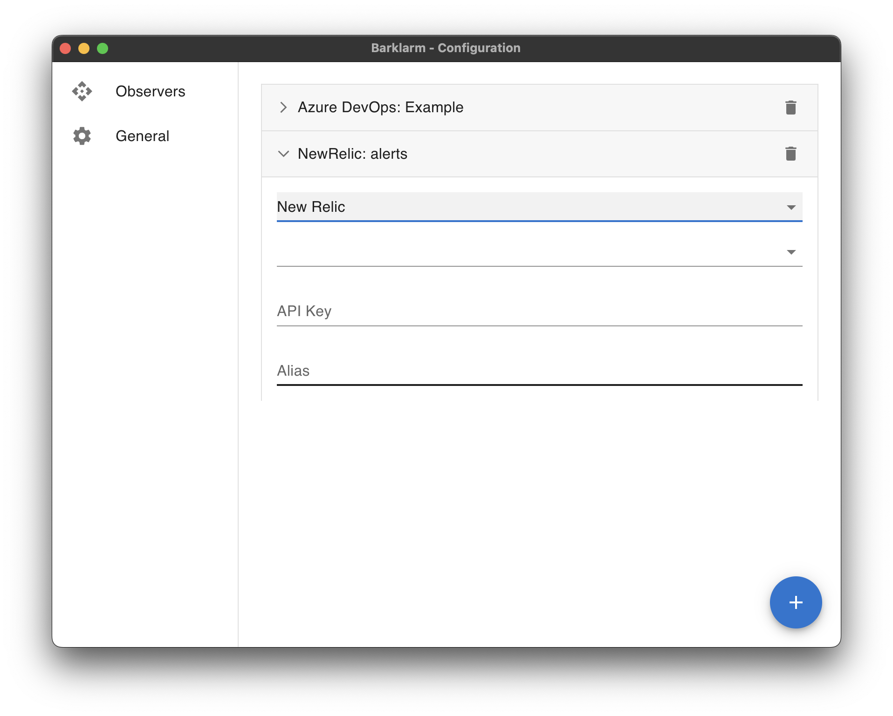

# New Relic

The New Relic configuration requires:

* **Site (Mandatory)**: the New Relic site your project resides on.
* **API Key (Mandatory)**: [API Key](https://docs.newrelic.com/docs/apis/intro-apis/new-relic-api-keys/) to access the New Relic system.
* **Alias (Optional)**: A friendly name to display in the tray list.

There is also a **delete button** to remove this configuration from the list.