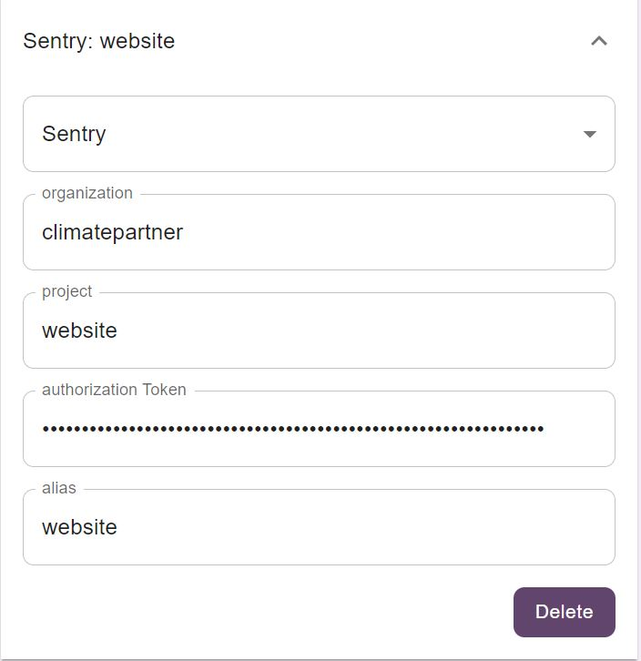

# Sentry

The Sentry configuration requires:
- **Organization (Mandatory)**: sentry organization handle.
- **Project (Mandatory)**: name of the project that the issues belongs to.
- **Authorization token (Mandatory)**: this is user access token to access the project.
- **Alias (Optional)**: A friendly name to display in the tray list.

There is also a **delete button** to remove this configuration from the list.